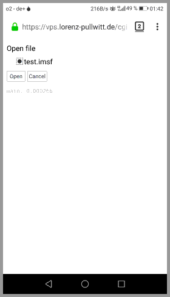

# MemorySurfer

A program (cgi-bin) to memorize (text- or HTML-based) flashcards. (Runs in a web browser on a web-server).

## Screenshots

Some screenshots could be viewed
[here](https://www.lorenz-pullwitt.de/MemorySurfer/en/screenshots.html "screenshots").

## Try / Online / Live Demo

You can try MemorySurfer online without installing anything on your computer.
[Try MemorySurfer without installing](https://vps.lorenz-pullwitt.de/cgi-bin/memorysurfer.cgi).

Here is a (little set of cards) <a href="https://www.lorenz-pullwitt.de/MemorySurfer/demo.xml" download>demo.xml</a> which you can use to Import (and testing).

## Installing MemorySurfer

The setup is described
[here](https://www.lorenz-pullwitt.de/MemorySurfer/en/setup.html "setup").

## Features

 - HTML or TXT cards
 - XML export / import (for backup and version control tracking)
 - hierarchical decks
 - passphrase (access control of session / file)
 - searching

## Requirements

 - gcc
 - make

Every Linux system * capable of running a web-server (eg. Apache) should also be capable of running MemorySurfer (tested on
[Raspbian](https://www.lorenz-pullwitt.de/MemorySurfer/en/raspbian.html "Raspbian"), Fedora, Debian, Ubuntu).

* currently only little-endian architecture
